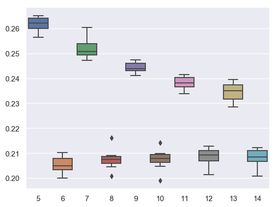
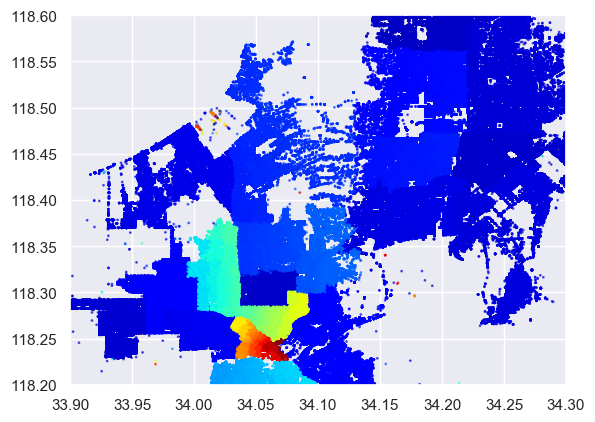
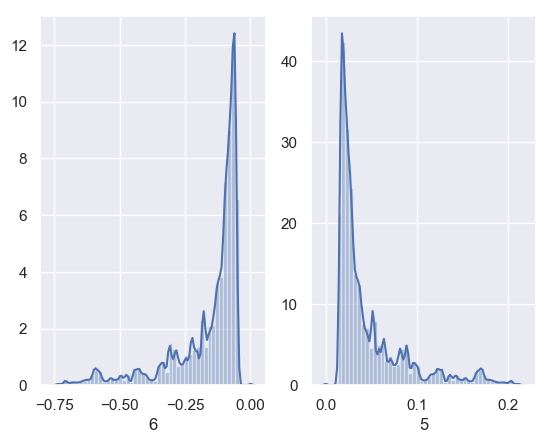
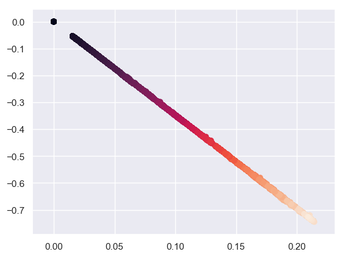

```python
import numpy as np
import pandas as pd
import matplotlib.pyplot as plt
import glob
import seaborn as sns
import datetime as dt
import json
from ast import literal_eval

from sklearn import preprocessing
from sklearn.model_selection import train_test_split
from sklearn.ensemble import RandomForestClassifier
from sklearn.metrics import accuracy_score
from sklearn.metrics import confusion_matrix
from sklearn.metrics import roc_auc_score
from sklearn.metrics import classification_report

import warnings
warnings.filterwarnings('ignore')
```


```python
crime_df = pd.read_csv('Crime_Data_2010_2017.csv')
crime_df.head()
```


<div>
<style scoped>
    .dataframe tbody tr th:only-of-type {
        vertical-align: middle;
    }

    .dataframe tbody tr th {
        vertical-align: top;
    }

    .dataframe thead th {
        text-align: right;
    }
</style>
<table border="1" class="dataframe">
  <thead>
    <tr style="text-align: right;">
      <th></th>
      <th>DR Number</th>
      <th>Date Reported</th>
      <th>Date Occurred</th>
      <th>Time Occurred</th>
      <th>Area ID</th>
      <th>Area Name</th>
      <th>Reporting District</th>
      <th>Crime Code</th>
      <th>Crime Code Description</th>
      <th>MO Codes</th>
      <th>...</th>
      <th>Weapon Description</th>
      <th>Status Code</th>
      <th>Status Description</th>
      <th>Crime Code 1</th>
      <th>Crime Code 2</th>
      <th>Crime Code 3</th>
      <th>Crime Code 4</th>
      <th>Address</th>
      <th>Cross Street</th>
      <th>Location</th>
    </tr>
  </thead>
  <tbody>
    <tr>
      <th>0</th>
      <td>1208575</td>
      <td>03/14/2013</td>
      <td>03/11/2013</td>
      <td>1800</td>
      <td>12</td>
      <td>77th Street</td>
      <td>1241</td>
      <td>626</td>
      <td>INTIMATE PARTNER - SIMPLE ASSAULT</td>
      <td>0416 0446 1243 2000</td>
      <td>...</td>
      <td>STRONG-ARM (HANDS, FIST, FEET OR BODILY FORCE)</td>
      <td>AO</td>
      <td>Adult Other</td>
      <td>626.0</td>
      <td>NaN</td>
      <td>NaN</td>
      <td>NaN</td>
      <td>6300    BRYNHURST                    AV</td>
      <td>NaN</td>
      <td>(33.9829, -118.3338)</td>
    </tr>
    <tr>
      <th>1</th>
      <td>102005556</td>
      <td>01/25/2010</td>
      <td>01/22/2010</td>
      <td>2300</td>
      <td>20</td>
      <td>Olympic</td>
      <td>2071</td>
      <td>510</td>
      <td>VEHICLE - STOLEN</td>
      <td>NaN</td>
      <td>...</td>
      <td>NaN</td>
      <td>IC</td>
      <td>Invest Cont</td>
      <td>510.0</td>
      <td>NaN</td>
      <td>NaN</td>
      <td>NaN</td>
      <td>VAN NESS</td>
      <td>15TH</td>
      <td>(34.0454, -118.3157)</td>
    </tr>
    <tr>
      <th>2</th>
      <td>418</td>
      <td>03/19/2013</td>
      <td>03/18/2013</td>
      <td>2030</td>
      <td>18</td>
      <td>Southeast</td>
      <td>1823</td>
      <td>510</td>
      <td>VEHICLE - STOLEN</td>
      <td>NaN</td>
      <td>...</td>
      <td>NaN</td>
      <td>IC</td>
      <td>Invest Cont</td>
      <td>510.0</td>
      <td>NaN</td>
      <td>NaN</td>
      <td>NaN</td>
      <td>200 E  104TH                        ST</td>
      <td>NaN</td>
      <td>(33.942, -118.2717)</td>
    </tr>
    <tr>
      <th>3</th>
      <td>101822289</td>
      <td>11/11/2010</td>
      <td>11/10/2010</td>
      <td>1800</td>
      <td>18</td>
      <td>Southeast</td>
      <td>1803</td>
      <td>510</td>
      <td>VEHICLE - STOLEN</td>
      <td>NaN</td>
      <td>...</td>
      <td>NaN</td>
      <td>IC</td>
      <td>Invest Cont</td>
      <td>510.0</td>
      <td>NaN</td>
      <td>NaN</td>
      <td>NaN</td>
      <td>88TH</td>
      <td>WALL</td>
      <td>(33.9572, -118.2717)</td>
    </tr>
    <tr>
      <th>4</th>
      <td>42104479</td>
      <td>01/11/2014</td>
      <td>01/04/2014</td>
      <td>2300</td>
      <td>21</td>
      <td>Topanga</td>
      <td>2133</td>
      <td>745</td>
      <td>VANDALISM - MISDEAMEANOR ($399 OR UNDER)</td>
      <td>0329</td>
      <td>...</td>
      <td>NaN</td>
      <td>IC</td>
      <td>Invest Cont</td>
      <td>745.0</td>
      <td>NaN</td>
      <td>NaN</td>
      <td>NaN</td>
      <td>7200    CIRRUS                       WY</td>
      <td>NaN</td>
      <td>(34.2009, -118.6369)</td>
    </tr>
  </tbody>
</table>
<p>5 rows × 26 columns</p>
</div>


```python
occurred = pd.to_datetime(crime_df['Date Occurred'], infer_datetime_format=True)
reported = pd.to_datetime(crime_df['Date Reported'], infer_datetime_format=True)

crime_df['year'] = occurred.map(lambda x: x.year)
crime_df['month'] = occurred.map(lambda x: x.month)
crime_df['day'] = occurred.map(lambda x: x.day)
crime_df['weekday'] = occurred.map(lambda x: x.weekday())

crime_df = crime_df.drop(columns=['Date Occurred', 'Date Reported'])
```


```python
crime_df.info()
```

    <class 'pandas.core.frame.DataFrame'>
    RangeIndex: 1584316 entries, 0 to 1584315
    Data columns (total 28 columns):
    DR Number                 1584316 non-null int64
    Time Occurred             1584316 non-null int64
    Area ID                   1584316 non-null int64
    Area Name                 1584316 non-null object
    Reporting District        1584316 non-null int64
    Crime Code                1584316 non-null int64
    Crime Code Description    1583904 non-null object
    MO Codes                  1412557 non-null object
    Victim Age                1455657 non-null float64
    Victim Sex                1439117 non-null object
    Victim Descent            1439084 non-null object
    Premise Code              1584240 non-null float64
    Premise Description       1581565 non-null object
    Weapon Used Code          524757 non-null float64
    Weapon Description        524756 non-null object
    Status Code               1584314 non-null object
    Status Description        1584316 non-null object
    Crime Code 1              1584309 non-null float64
    Crime Code 2              99997 non-null float64
    Crime Code 3              2183 non-null float64
    Crime Code 4              69 non-null float64
    Address                   1584316 non-null object
    Cross Street              262733 non-null object
    Location                  1584307 non-null object
    year                      1584316 non-null int64
    month                     1584316 non-null int64
    day                       1584316 non-null int64
    weekday                   1584316 non-null int64
    dtypes: float64(7), int64(9), object(12)
    memory usage: 338.4+ MB
    


```python
crime_df.columns
```


    Index(['DR Number', 'Time Occurred', 'Area ID', 'Area Name',
           'Reporting District', 'Crime Code', 'Crime Code Description',
           'MO Codes', 'Victim Age', 'Victim Sex', 'Victim Descent',
           'Premise Code', 'Premise Description', 'Weapon Used Code',
           'Weapon Description', 'Status Code', 'Status Description',
           'Crime Code 1', 'Crime Code 2', 'Crime Code 3', 'Crime Code 4',
           'Address', 'Cross Street', 'Location ', 'year', 'month', 'day',
           'weekday'],
          dtype='object')


## Can imagine a few interesting things already:

    1) What is the breakdown by crime per year per area?  Are there any trends?  What about violent vs nonviolent?
    2) What is the breakdown of victim statistics per crime type? per crime type per area?
    3) Can we create a map using GPS coords and use that to predict how the system will evolve?  How are nearest areas related? 
    4) When do crimes occur?  Does this depend on the type of crime?
    5) Does this data match our shooting data for LA?  What about our population data? Can we include population and income by area and see how that factors in?
    6) Should also check what percentage of crimes (by type/area) get reported. What actually makes it to this list?
    
$$ Crime = Bad $$

Let's create: Time of Day Columns, day/month/year/weekday, crime_type_by_month, crime_type_by_weekday, 
    Victim columns (crime by race/sex/age of victim?), DISTANCE FROM POLICE STATION, 
    crime_type_by_time_of_day, population_by_areaID, sqarea_by_areaID, income_by_areaID
    
      What type of map should I create?  If I can only choose to color-code one way (and perhaps add size and even evolution by year), what will I decide on?


```python
crime_type_by_year = crime_df.groupby(['Crime Code Description', 'year']).count()[['DR Number']]
crime_type_by_year.reset_index(inplace=True)
crime_type_by_year.columns = ['Crime Code Description', 'year', 'Crime_per_year']
```


```python
## Let's take a look at some examples of total crime change by category over the last 7 years ##

crime_by_type = crime_df.groupby('Crime Code Description').count()['DR Number'].sort_values(ascending=False)
examples = crime_by_type[[0, 1, 3, 4, 6, 9, 11, 14]].index

df = crime_type_by_year[crime_type_by_year['Crime Code Description'].isin(examples)]

plt.style.use('default')
plt.figure(figsize=(10,8))
p = sns.lineplot(x = df.year, y = df.Crime_per_year, hue=df['Crime Code Description'])
p.legend(loc='center right', bbox_to_anchor=(1.75, 0.5), ncol=1, fontsize='large', labelspacing=2)

plt.xlim([2010, 2016])
plt.show()
```


```python
crime_df.sort_values(by=['year', 'month'], ascending=False);
```


```python
## What about by area? ##

crime_by_area = crime_df.groupby(['Crime Code Description', 'Area ID']).count()[['DR Number']]
crime_by_area.reset_index(inplace=True)
crime_by_area.columns = ['Crime Code Description', 'Area ID', 'crimes_by_area']
```


```python
## Notes precincts 12 and 3 border one another (around Compton)  ##

crime_by_area.sort_values(by = 'crimes_by_area', ascending=False).head()
```


<div>
<style scoped>
    .dataframe tbody tr th:only-of-type {
        vertical-align: middle;
    }

    .dataframe tbody tr th {
        vertical-align: top;
    }

    .dataframe thead th {
        text-align: right;
    }
</style>
<table border="1" class="dataframe">
  <thead>
    <tr style="text-align: right;">
      <th></th>
      <th>Crime Code Description</th>
      <th>Area ID</th>
      <th>crimes_by_area</th>
    </tr>
  </thead>
  <tbody>
    <tr>
      <th>98</th>
      <td>BATTERY - SIMPLE ASSAULT</td>
      <td>12</td>
      <td>12208</td>
    </tr>
    <tr>
      <th>89</th>
      <td>BATTERY - SIMPLE ASSAULT</td>
      <td>3</td>
      <td>11196</td>
    </tr>
    <tr>
      <th>87</th>
      <td>BATTERY - SIMPLE ASSAULT</td>
      <td>1</td>
      <td>10382</td>
    </tr>
    <tr>
      <th>2355</th>
      <td>VEHICLE - STOLEN</td>
      <td>12</td>
      <td>9831</td>
    </tr>
    <tr>
      <th>2059</th>
      <td>THEFT PLAIN - PETTY ($950 &amp; UNDER)</td>
      <td>3</td>
      <td>9730</td>
    </tr>
  </tbody>
</table>
</div>


```python
crime_df.groupby(['Area Name']).count()['DR Number']
```


    Area Name
    77th Street    110605
    Central         67096
    Devonshire      74013
    Foothill        60939
    Harbor          70954
    Hollenbeck      57592
    Hollywood       72239
    Mission         80249
    N Hollywood     86405
    Newton          74385
    Northeast       76627
    Olympic         70133
    Pacific         83763
    Rampart         67010
    Southeast       83517
    Southwest      102259
    Topanga         73291
    Van Nuys        75456
    West LA         66388
    West Valley     67797
    Wilshire        63598
    Name: DR Number, dtype: int64


```python
crime_df['x_loc'] = crime_df[crime_df['Location '].notna()]['Location '].map(lambda x: eval(x)[0])
crime_df['y_loc'] = crime_df[crime_df['Location '].notna()]['Location '].map(lambda x: eval(x)[1])
```

Want to fill missing values of the 9 missing locations with the average value in the reporting district.


df_slice = crime_df[crime_df['Location '].isnull()]
lookup_table = crime_df.groupby('Reporting District').mean()[['x_loc', 'y_loc']]

for i in range(9):
    
    reporting_district = df_slice.iloc[i]['Reporting District']
    new_x, new_y = lookup_table.iloc[i].values[0], lookup_table.iloc[i].values[1]
    df_slice['x_loc'][i], df_slice['y_loc'][i] = new_x, new_y

df_slice


```python
crime_df.groupby(['Area Name']).count()['DR Number']
```


    Area Name
    77th Street    110605
    Central         67096
    Devonshire      74013
    Foothill        60939
    Harbor          70954
    Hollenbeck      57592
    Hollywood       72239
    Mission         80249
    N Hollywood     86405
    Newton          74385
    Northeast       76627
    Olympic         70133
    Pacific         83763
    Rampart         67010
    Southeast       83517
    Southwest      102259
    Topanga         73291
    Van Nuys        75456
    West LA         66388
    West Valley     67797
    Wilshire        63598
    Name: DR Number, dtype: int64


```python
loc_slice = crime_df.query('34.4 > x_loc > 33.9')

loc_slice = loc_slice.groupby('Reporting District').agg(['mean', 'count'])[['x_loc', 'y_loc']]
x_vals = loc_slice['x_loc', 'mean'].values
y_vals = loc_slice['y_loc', 'mean'].values
z_vals = loc_slice['x_loc', 'count'].values

plt.figure(figsize=(10,8))

plt.style.use('default')
sns.scatterplot(x = x_vals, y = y_vals, hue = z_vals, palette = sns.light_palette("#E15700", input="rgb", as_cmap=True, n_colors=12), s=50, alpha = 1)

plt.ylim([-118.7, -118.1])
plt.show()
```


```python
crime_df['hour'] = crime_df['Time Occurred'] // 100
```


```python
fig, ax = plt.subplots(figsize=(10,8))
sns.set()
sns.distplot(crime_df['Time Occurred'].values, bins=24, kde=False)

# Annotate most frequent crime in that hour
#for hr, crimes in zip(x*100, y):
#    ax.text(hr, crimes + 3000, crimes, horizontalalignment='center', fontdict={'color':'black', 'size':14})

x = crime_severity_hour[crime_severity_hour['crime_type'] == 'violent'].hour.values
y = crime_severity_hour[crime_severity_hour['crime_type'] == 'violent'].crime_class_hr.values
sns.lineplot(x*100, y, color='red')


plt.xlim([0, 2359])
plt.xticks(ticks=[100, 500, 900, 1200, 1600, 2000], labels = ['1am', '5am', '9am', '12pm', '4pm', '8pm'])
plt.show()

## include label that shows most popular crime in that hour ##
```


See an interesting spike in afternoon crime. Alone with the expected rise in the evnenings and drop off in the early hours.

It'll be interesting to see how this depends on the area and type of crime...


```python
fig, ax = plt.subplots(7, 1, sharey=True, sharex=True, figsize=(10, 15))

for weekday in crime_df.weekday.unique():
    sns.distplot(crime_df.loc[crime_df['weekday'] == weekday, 'Time Occurred'].values, bins=24, ax=ax[weekday], kde=False)

plt.xlim([0, 2359])
plt.xticks(ticks=[100, 500, 900, 1200, 1600, 2000], labels = ['1am', '5am', '9am', '12pm', '4pm', '8pm'])

plt.show()
```


### Seems pretty similar by weekday. Only differences appear to be the noon spike (stronger during week), and the behavior of late night (higher for the weekend)

        Show this plot as a difference from average using green and red values


```python
crime_type_by_hour = crime_df.groupby(['hour', 'Crime Code Description']).count()[['DR Number']]
crime_type_by_hour.reset_index(inplace=True)
crime_type_by_hour.columns = ['hour', 'Crime Code Description', 'Crimes_type_hour']
```


```python
crime_type_by_hour.sort_values(by=['hour', 'Crimes_type_hour'], ascending=False).groupby('hour').head(5)
```


<div>
<style scoped>
    .dataframe tbody tr th:only-of-type {
        vertical-align: middle;
    }

    .dataframe tbody tr th {
        vertical-align: top;
    }

    .dataframe thead th {
        text-align: right;
    }
</style>
<table border="1" class="dataframe">
  <thead>
    <tr style="text-align: right;">
      <th></th>
      <th>hour</th>
      <th>Crime Code Description</th>
      <th>Crimes_type_hour</th>
    </tr>
  </thead>
  <tbody>
    <tr>
      <th>2683</th>
      <td>23</td>
      <td>BURGLARY FROM VEHICLE</td>
      <td>8957</td>
    </tr>
    <tr>
      <th>2775</th>
      <td>23</td>
      <td>VEHICLE - STOLEN</td>
      <td>8605</td>
    </tr>
    <tr>
      <th>2671</th>
      <td>23</td>
      <td>BATTERY - SIMPLE ASSAULT</td>
      <td>6743</td>
    </tr>
    <tr>
      <th>2725</th>
      <td>23</td>
      <td>INTIMATE PARTNER - SIMPLE ASSAULT</td>
      <td>5892</td>
    </tr>
    <tr>
      <th>2772</th>
      <td>23</td>
      <td>VANDALISM - FELONY ($400 &amp; OVER, ALL CHURCH VA...</td>
      <td>5092</td>
    </tr>
    <tr>
      <th>2661</th>
      <td>22</td>
      <td>VEHICLE - STOLEN</td>
      <td>10540</td>
    </tr>
    <tr>
      <th>2571</th>
      <td>22</td>
      <td>BURGLARY FROM VEHICLE</td>
      <td>10494</td>
    </tr>
    <tr>
      <th>2558</th>
      <td>22</td>
      <td>BATTERY - SIMPLE ASSAULT</td>
      <td>7442</td>
    </tr>
    <tr>
      <th>2658</th>
      <td>22</td>
      <td>VANDALISM - FELONY ($400 &amp; OVER, ALL CHURCH VA...</td>
      <td>5955</td>
    </tr>
    <tr>
      <th>2610</th>
      <td>22</td>
      <td>INTIMATE PARTNER - SIMPLE ASSAULT</td>
      <td>5911</td>
    </tr>
    <tr>
      <th>2549</th>
      <td>21</td>
      <td>VEHICLE - STOLEN</td>
      <td>10108</td>
    </tr>
    <tr>
      <th>2452</th>
      <td>21</td>
      <td>BURGLARY FROM VEHICLE</td>
      <td>9941</td>
    </tr>
    <tr>
      <th>2438</th>
      <td>21</td>
      <td>BATTERY - SIMPLE ASSAULT</td>
      <td>8257</td>
    </tr>
    <tr>
      <th>2494</th>
      <td>21</td>
      <td>INTIMATE PARTNER - SIMPLE ASSAULT</td>
      <td>5874</td>
    </tr>
    <tr>
      <th>2546</th>
      <td>21</td>
      <td>VANDALISM - FELONY ($400 &amp; OVER, ALL CHURCH VA...</td>
      <td>5815</td>
    </tr>
    <tr>
      <th>2330</th>
      <td>20</td>
      <td>BURGLARY FROM VEHICLE</td>
      <td>10211</td>
    </tr>
    <tr>
      <th>2429</th>
      <td>20</td>
      <td>VEHICLE - STOLEN</td>
      <td>10027</td>
    </tr>
    <tr>
      <th>2316</th>
      <td>20</td>
      <td>BATTERY - SIMPLE ASSAULT</td>
      <td>8640</td>
    </tr>
    <tr>
      <th>2426</th>
      <td>20</td>
      <td>VANDALISM - FELONY ($400 &amp; OVER, ALL CHURCH VA...</td>
      <td>5680</td>
    </tr>
    <tr>
      <th>2375</th>
      <td>20</td>
      <td>INTIMATE PARTNER - SIMPLE ASSAULT</td>
      <td>5493</td>
    </tr>
    <tr>
      <th>2212</th>
      <td>19</td>
      <td>BURGLARY FROM VEHICLE</td>
      <td>9599</td>
    </tr>
    <tr>
      <th>2307</th>
      <td>19</td>
      <td>VEHICLE - STOLEN</td>
      <td>9200</td>
    </tr>
    <tr>
      <th>2199</th>
      <td>19</td>
      <td>BATTERY - SIMPLE ASSAULT</td>
      <td>8512</td>
    </tr>
    <tr>
      <th>2293</th>
      <td>19</td>
      <td>THEFT PLAIN - PETTY ($950 &amp; UNDER)</td>
      <td>5808</td>
    </tr>
    <tr>
      <th>2304</th>
      <td>19</td>
      <td>VANDALISM - FELONY ($400 &amp; OVER, ALL CHURCH VA...</td>
      <td>5278</td>
    </tr>
    <tr>
      <th>2095</th>
      <td>18</td>
      <td>BURGLARY FROM VEHICLE</td>
      <td>9405</td>
    </tr>
    <tr>
      <th>2190</th>
      <td>18</td>
      <td>VEHICLE - STOLEN</td>
      <td>9011</td>
    </tr>
    <tr>
      <th>2080</th>
      <td>18</td>
      <td>BATTERY - SIMPLE ASSAULT</td>
      <td>8470</td>
    </tr>
    <tr>
      <th>2177</th>
      <td>18</td>
      <td>THEFT PLAIN - PETTY ($950 &amp; UNDER)</td>
      <td>6817</td>
    </tr>
    <tr>
      <th>2094</th>
      <td>18</td>
      <td>BURGLARY</td>
      <td>6281</td>
    </tr>
    <tr>
      <th>...</th>
      <td>...</td>
      <td>...</td>
      <td>...</td>
    </tr>
    <tr>
      <th>573</th>
      <td>5</td>
      <td>BURGLARY</td>
      <td>2330</td>
    </tr>
    <tr>
      <th>656</th>
      <td>5</td>
      <td>VEHICLE - STOLEN</td>
      <td>1788</td>
    </tr>
    <tr>
      <th>574</th>
      <td>5</td>
      <td>BURGLARY FROM VEHICLE</td>
      <td>1480</td>
    </tr>
    <tr>
      <th>607</th>
      <td>5</td>
      <td>INTIMATE PARTNER - SIMPLE ASSAULT</td>
      <td>1317</td>
    </tr>
    <tr>
      <th>561</th>
      <td>5</td>
      <td>BATTERY - SIMPLE ASSAULT</td>
      <td>1314</td>
    </tr>
    <tr>
      <th>469</th>
      <td>4</td>
      <td>BURGLARY</td>
      <td>2322</td>
    </tr>
    <tr>
      <th>503</th>
      <td>4</td>
      <td>INTIMATE PARTNER - SIMPLE ASSAULT</td>
      <td>1761</td>
    </tr>
    <tr>
      <th>458</th>
      <td>4</td>
      <td>BATTERY - SIMPLE ASSAULT</td>
      <td>1618</td>
    </tr>
    <tr>
      <th>552</th>
      <td>4</td>
      <td>VEHICLE - STOLEN</td>
      <td>1579</td>
    </tr>
    <tr>
      <th>470</th>
      <td>4</td>
      <td>BURGLARY FROM VEHICLE</td>
      <td>1552</td>
    </tr>
    <tr>
      <th>402</th>
      <td>3</td>
      <td>INTIMATE PARTNER - SIMPLE ASSAULT</td>
      <td>2629</td>
    </tr>
    <tr>
      <th>351</th>
      <td>3</td>
      <td>BATTERY - SIMPLE ASSAULT</td>
      <td>2623</td>
    </tr>
    <tr>
      <th>363</th>
      <td>3</td>
      <td>BURGLARY</td>
      <td>2362</td>
    </tr>
    <tr>
      <th>364</th>
      <td>3</td>
      <td>BURGLARY FROM VEHICLE</td>
      <td>2226</td>
    </tr>
    <tr>
      <th>420</th>
      <td>3</td>
      <td>ROBBERY</td>
      <td>1906</td>
    </tr>
    <tr>
      <th>236</th>
      <td>2</td>
      <td>BATTERY - SIMPLE ASSAULT</td>
      <td>4918</td>
    </tr>
    <tr>
      <th>291</th>
      <td>2</td>
      <td>INTIMATE PARTNER - SIMPLE ASSAULT</td>
      <td>3392</td>
    </tr>
    <tr>
      <th>252</th>
      <td>2</td>
      <td>BURGLARY FROM VEHICLE</td>
      <td>3039</td>
    </tr>
    <tr>
      <th>234</th>
      <td>2</td>
      <td>ASSAULT WITH DEADLY WEAPON, AGGRAVATED ASSAULT</td>
      <td>3023</td>
    </tr>
    <tr>
      <th>342</th>
      <td>2</td>
      <td>VEHICLE - STOLEN</td>
      <td>2661</td>
    </tr>
    <tr>
      <th>120</th>
      <td>1</td>
      <td>BATTERY - SIMPLE ASSAULT</td>
      <td>5668</td>
    </tr>
    <tr>
      <th>176</th>
      <td>1</td>
      <td>INTIMATE PARTNER - SIMPLE ASSAULT</td>
      <td>3939</td>
    </tr>
    <tr>
      <th>136</th>
      <td>1</td>
      <td>BURGLARY FROM VEHICLE</td>
      <td>3887</td>
    </tr>
    <tr>
      <th>118</th>
      <td>1</td>
      <td>ASSAULT WITH DEADLY WEAPON, AGGRAVATED ASSAULT</td>
      <td>3602</td>
    </tr>
    <tr>
      <th>227</th>
      <td>1</td>
      <td>VEHICLE - STOLEN</td>
      <td>3486</td>
    </tr>
    <tr>
      <th>96</th>
      <td>0</td>
      <td>THEFT OF IDENTITY</td>
      <td>10561</td>
    </tr>
    <tr>
      <th>4</th>
      <td>0</td>
      <td>BATTERY - SIMPLE ASSAULT</td>
      <td>5197</td>
    </tr>
    <tr>
      <th>17</th>
      <td>0</td>
      <td>BURGLARY FROM VEHICLE</td>
      <td>4987</td>
    </tr>
    <tr>
      <th>111</th>
      <td>0</td>
      <td>VEHICLE - STOLEN</td>
      <td>4176</td>
    </tr>
    <tr>
      <th>59</th>
      <td>0</td>
      <td>INTIMATE PARTNER - SIMPLE ASSAULT</td>
      <td>4149</td>
    </tr>
  </tbody>
</table>
<p>120 rows × 3 columns</p>
</div>


```python
bins = pd.IntervalIndex.from_tuples([(0, 5), (5, 9), (9, 17), (17, 21), (21, 24)], closed='left')
pd.cut(crime_df['hour'], bins=bins, labels =['Night', 'Morning', 'Daytime', 'Evening', 'Night']);
```


```python
violent = ['BATTERY - SIMPLE ASSAULT', 'INTIMATE PARTNER - SIMPLE ASSAULT', 'CRIMINAL HOMICIDE', 'ASSAULT WITH DEADLY WEAPON ON POLICE OFFICER',\
          'DISCHARGE FIREARMS/SHOTS FIRED', 'BATTERY POLICE (SIMPLE)', 'RAPE', 'FORCIBLE BATTERY WITH SEXUAL CONTACT', 'INTIMATE PARTNER - AGGRAVATED ASSAULT',\
          'ROBBERY', 'SHOTS FIRED AT INHABITED DWELLING', 'OTHER ASSAULT', 'KIDNAPPING', 'BRANDISH WEAPON', 'ATTEMPTED ROBBERY']

theft = ['BURGLARY', 'THEFT PLAIN - PETTY ($950 & UNDER)', 'THEFT OF IDENTITY',\
        'VANDALISM - FELONY ($400 & OVER, ALL CHURCH VANDALISMS) 0114',\
        'VANDALISM - MISDEAMEANOR ($399 OR UNDER)', 'THEFT-GRAND ($950.01 & OVER)EXCPT,GUNS,FOWL,LIVESTK,PROD0036',\
        'SHOPLIFTING - PETTY THEFT ($950 & UNDER)', 'THEFT, PERSON', 'BURGLARY, ATTEMPTED',\
        'BIKE - STOLEN', 'BUNCO, PETTY THEFT', 'BUNCO, GRAND THEFT', 'SHOPLIFTING-GRAND THEFT ($950.01 & OVER)',\
        'THEFT PLAIN - ATTEMPT']

vehicular = ['VEHICLE - STOLEN', 'BURGLARY FROM VEHICLE', 'THEFT FROM MOTOR VEHICLE - PETTY ($950 & UNDER)', \
             'THEFT FROM MOTOR VEHICLE - GRAND ($400 AND OVER)', 'VEHICLE - ATTEMPT STOLEN', 'BURGLARY FROM VEHICLE, ATTEMPTED']

crime_df['crime_type'] = crime_df['Crime Code Description'].apply(lambda x: 'violent' if x in violent else 'nonviolent')
crime_df['theft'] = crime_df['Crime Code Description'].apply(lambda x: 1 if x in theft else 0)
crime_df['vehicular'] = crime_df['Crime Code Description'].apply(lambda x: 1 if x in vehicular else 0)

```


```python
crime_severity_hour = crime_df.groupby(['hour', 'crime_type']).count()['DR Number'].reset_index()
crime_severity_hour.columns = ['hour', 'crime_type', 'crime_class_hr']
```


```python
# avg Crimes per hour over the course of the past 6-7 years

avg_crime_per_hour = (crime_df.groupby(['hour']).count()['DR Number'] / (7*365)).round()
```


```python
crime_df.query('hour == 12').groupby('Crime Code Description').count()['DR Number'].sort_values(ascending=False).head(5)
```


    Crime Code Description
    THEFT OF IDENTITY                                               32827
    THEFT PLAIN - PETTY ($950 & UNDER)                               9704
    BURGLARY                                                         8110
    BATTERY - SIMPLE ASSAULT                                         7986
    THEFT-GRAND ($950.01 & OVER)EXCPT,GUNS,FOWL,LIVESTK,PROD0036     6400
    Name: DR Number, dtype: int64


```python
#  Looks like identity thefts get default set to noon in the absense of a clear time.  Should impute the average of 11 and 13 to be its new values and note difference #

crime_df.loc[crime_df['Crime Code Description'] == 'THEFT OF IDENTITY', :].groupby('hour').count()['DR Number'].sort_values(ascending=False)
```


    hour
    12    32827
    8     11293
    0     10561
    9      6209
    10     5323
    15     4407
    14     3942
    13     3773
    16     3198
    11     3138
    17     2701
    18     2260
    6      1840
    7      1824
    19     1563
    20     1401
    21      919
    1       905
    23      702
    22      678
    5       314
    2       311
    3       284
    4       280
    Name: DR Number, dtype: int64


```python
violent_crime_per_area = crime_df[crime_df['crime_type'] == 'violent'].groupby('Area ID').count()['DR Number']
tot_crime_per_area = crime_df.groupby('Area Name').count()['DR Number']
```


```python
fig, ax = plt.subplots(figsize=(16,9))

sns.barplot(violent_crime_per_area.index, violent_crime_per_area.values, color='red')
sns.barplot(tot_crime_per_area.index, tot_crime_per_area.values, color='grey', alpha=0.5)

ratio = violent_crime_per_area.values / tot_crime_per_area.values
for i, rat in enumerate(ratio):
    ax.text(i, violent_crime_per_area[i+1] + 2000, str(int(rat * 100))+'%' , horizontalalignment='center', fontdict={'size':15})

plt.xticks(violent_crime_per_area.index - 0.5, rotation=60, horizontalalignment='right', fontsize=14)
plt.yticks(ticks = [20000, 40000, 60000, 80000, 100000], labels = ['20k', '40k', '60k', '80k', '100k'], fontsize=14)
#ax.legend(['Grey', 'Red'], ['Total', 'Violent'])

ax.set_title('Total (grey), Violent (red) Crimes Committed in LAs Subegions', fontdict={'size':22})
ax.set(ylabel='', xlabel='')


plt.show()
```


```python
violent_crime_per_area[1]
```


    19282


## Can I predict what type of crime will occur and who will be the victim given the location, time of day, weekday, month


```python
train_cols = ['hour', 'month', 'day', 'weekday', 'x_loc', 'y_loc', 'Area ID', 'Reporting District'] #add premise description later#
test_cols = ['Victim Age', 'Victim Sex', 'Victim Descent', 'crime_type', 'Crime Code']
```


```python
model_df = crime_df.copy()
model_df = model_df[['crime_type', 'hour', 'month', 'day', 'weekday', 'x_loc', 'y_loc', 'Area ID', 'Reporting District']]
model_df = model_df.dropna()
```


```python
X = model_df[train_cols]
Y = model_df['crime_type'].map(lambda x: 1 if x == 'violent' else 0)

X_train, X_test, y_train, y_test = train_test_split(X, Y)

clf = RandomForestClassifier(n_estimators = 50, criterion = 'gini',\
max_depth = 25, max_features=4)

clf.fit(X_train, y_train)

y_train_pred = clf.predict(X_train)
y_test_pred = clf.predict(X_test)

print('train accuracy is', accuracy_score(y_train, y_train_pred) \
      ,'and test accuracy is', accuracy_score(y_test, y_test_pred))
```

    train accuracy is 0.9298586973902359 and test accuracy is 0.7885183941506323
    


```python
feat_importance = pd.DataFrame(list(zip(train_cols, clf.feature_importances_)))

feat_importance.sort_values(1, ascending=False).head()
```


<div>
<style scoped>
    .dataframe tbody tr th:only-of-type {
        vertical-align: middle;
    }

    .dataframe tbody tr th {
        vertical-align: top;
    }

    .dataframe thead th {
        text-align: right;
    }
</style>
<table border="1" class="dataframe">
  <thead>
    <tr style="text-align: right;">
      <th></th>
      <th>0</th>
      <th>1</th>
    </tr>
  </thead>
  <tbody>
    <tr>
      <th>5</th>
      <td>y_loc</td>
      <td>0.237861</td>
    </tr>
    <tr>
      <th>4</th>
      <td>x_loc</td>
      <td>0.206221</td>
    </tr>
    <tr>
      <th>7</th>
      <td>Reporting District</td>
      <td>0.145369</td>
    </tr>
    <tr>
      <th>0</th>
      <td>hour</td>
      <td>0.145059</td>
    </tr>
    <tr>
      <th>2</th>
      <td>day</td>
      <td>0.097280</td>
    </tr>
  </tbody>
</table>
</div>


```python
print(classification_report(y_test, y_test_pred))
```

                  precision    recall  f1-score   support
    
               0       0.80      0.98      0.88    311818
               1       0.52      0.10      0.16     84259
    
       micro avg       0.79      0.79      0.79    396077
       macro avg       0.66      0.54      0.52    396077
    weighted avg       0.74      0.79      0.73    396077
    
    


```python
figure, ax = plt.subplots(figsize=(12, 10))
i = 1
# iterate over datasets

x_min, x_max = X['x_loc'].min(), X['x_loc'].max()
y_min, y_max = X['y_loc'].min(), X['y_loc'].max()
xx, yy = np.meshgrid(np.arange(x_min, x_max),
                         np.arange(y_min, y_max))

    # just plot the dataset first
cm = plt.cm.jet
    # Plot the training points
ax.scatter(X_train['x_loc'], X_train['y_loc'], c=y_train, cmap='viridis', alpha=0.7)
ax.scatter(X_test['x_loc'], X_test['y_loc'], c=y_test, cmap='jet', alpha=0.6)

plt.ylim([-118.7, -118.1])
plt.xlim([33.6, 34.4])

plt.show()
```


```python
xs = np.arange(33.7, 34.4, 0.001)
ys = np.arange(-118.7, -118.1, 0.001)

xx, yy = np.meshgrid(xs, ys)
```


```python
#rep #

X2 = model_df[['x_loc', 'y_loc']]
Y2 = model_df['crime_type'].map(lambda x: 1 if x == 'violent' else 0)

X2_train, X2_test, y2_train, y2_test = train_test_split(X2, Y2)

clf = RandomForestClassifier(n_estimators = 30, criterion = 'gini',\
max_depth = 15, max_features=2)

clf.fit(X2_train, y2_train)

y2_train_pred = clf.predict(X2_train)
y2_test_pred = clf.predict(X2_test)

print('train accuracy is', accuracy_score(y2_train, y2_train_pred) \
      ,'and test accuracy is', accuracy_score(y2_test, y2_test_pred))
```

    train accuracy is 0.7882101949959183 and test accuracy is 0.7871575476485633
    


```python
y_test_pred.mean()
```


    0.001365896025267814


```python
# Regional crime type evolution by hour #
```


```python
crime_df.groupby('Crime Code Description').count()['DR Number'].sort_values(ascending=False).tail(50)
```


    Crime Code Description
    FALSE POLICE REPORT                                             310
    DOCUMENT WORTHLESS ($200.01 & OVER)                             266
    FAILURE TO YIELD                                                249
    BOAT - STOLEN                                                   227
    THEFT FROM PERSON - ATTEMPT                                     223
    BATTERY ON A FIREFIGHTER                                        223
    PANDERING                                                       195
    CREDIT CARDS, FRAUD USE ($950 & UNDER                           186
    SHOTS FIRED AT MOVING VEHICLE, TRAIN OR AIRCRAFT                178
    RECKLESS DRIVING                                                178
    DEFRAUDING INNKEEPER/THEFT OF SERVICES, OVER $400               170
    THEFT, COIN MACHINE - PETTY ($950 & UNDER)                      168
    SHOPLIFTING - ATTEMPT                                           154
    CONTRIBUTING                                                    149
    WEAPONS POSSESSION/BOMBING                                      134
    DISHONEST EMPLOYEE - GRAND THEFT                                125
    DISHONEST EMPLOYEE - PETTY THEFT                                100
    CHILD ABANDONMENT                                                70
    TILL TAP - PETTY ($950 & UNDER)                                  64
    GRAND THEFT / INSURANCE FRAUD                                    63
    CONSPIRACY                                                       46
    PURSE SNATCHING - ATTEMPT                                        40
    DOCUMENT WORTHLESS ($200 & UNDER)                                39
    LYNCHING                                                         39
    DRUGS, TO A MINOR                                                37
    DISRUPT SCHOOL                                                   34
    TELEPHONE PROPERTY - DAMAGE                                      34
    THEFT, COIN MACHINE - GRAND ($950.01 & OVER)                     33
    BRIBERY                                                          29
    BIKE - ATTEMPTED STOLEN                                          27
    DRUNK ROLL                                                       26
    LYNCHING - ATTEMPTED                                             20
    PETTY THEFT - AUTO REPAIR                                        19
    BEASTIALITY, CRIME AGAINST NATURE SEXUAL ASSLT WITH ANIM0065     19
    FAILURE TO DISPERSE                                              18
    REPLICA FIREARMS(SALE,DISPLAY,MANUFACTURE OR DISTRIBUTE)0132     17
    THEFT, COIN MACHINE - ATTEMPT                                    17
    PICKPOCKET, ATTEMPT                                              15
    TILL TAP - GRAND THEFT ($950.01 & OVER)                          12
    GRAND THEFT / AUTO REPAIR                                        12
    BIGAMY                                                           10
    INCEST (SEXUAL ACTS BETWEEN BLOOD RELATIVES)                      8
    INCITING A RIOT                                                   8
    DISHONEST EMPLOYEE ATTEMPTED THEFT                                7
    BLOCKING DOOR INDUCTION CENTER                                    3
    MANSLAUGHTER, NEGLIGENT                                           3
    ABORTION/ILLEGAL                                                  3
    TILL TAP - ATTEMPT                                                2
    DRUNK ROLL - ATTEMPT                                              1
    TRAIN WRECKING                                                    1
    Name: DR Number, dtype: int64


```python
crime_df['theft'].sum()
```


    614922


```python
violent = crime_df[crime_df['crime_type'] == 'violent'].groupby('Area Name').count()['DR Number']
thefts = crime_df.groupby('Area Name').sum()['theft']
vehicular = crime_df.groupby('Area Name').sum()['vehicular']

fig, ax = plt.subplots(figsize=(16,9))

sns.barplot(thefts.index, thefts.values, color='green', alpha=0.7)
sns.barplot(vehicular.index, vehicular.values, bottom=thefts.values, color='yellow', alpha=0.7)
sns.barplot(violent.index, violent.values, bottom=vehicular.values+thefts.values, color='red')
sns.barplot(tot_crime_per_area.index, tot_crime_per_area.values, color='grey', alpha=0.5)

#ratio = violent_crime_per_area.values / tot_crime_per_area.values
#for i, rat in enumerate(ratio):
#    ax.text(i, violent_crime_per_area[i+1] + 2000, str(int(rat * 100))+'%' , horizontalalignment='center', fontdict={'size':15})

plt.xticks(violent_crime_per_area.index - 0.5, rotation=60, horizontalalignment='right', fontsize=14)
plt.yticks(ticks = [20000, 40000, 60000, 80000, 100000], labels = ['20k', '40k', '60k', '80k', '100k'], fontsize=14)
#ax.legend(['Grey', 'Red'], ['Total', 'Violent'])

#ax.set_title('Total (grey), Violent (red) Crimes Committed in LAs Subegions', fontdict={'size':22})
#ax.set(ylabel='', xlabel='')


plt.show()
```


```python
# The top 3 areas with the most violent crime are all clustered around the east part of Hollywood's main blvd #

crime_df[crime_df['crime_type'] == 'violent'].groupby('Reporting District').count()['DR Number'].sort_values(ascending=False).head()
```


    Reporting District
    646     1948
    636     1829
    645     1763
    1822    1719
    1801    1669
    Name: DR Number, dtype: int64


```python
X = model_df[train_cols]
Y = model_df['crime_type'].map(lambda x: 1 if x == 'violent' else 0)

X_train, X_test, y_train, y_test = train_test_split(X, Y)
```


```python
#scores = []
#
#for val in range(5, 15):
#    clf = RandomForestClassifier(n_estimators = val)
#    validated = cross_val_score(clf, X_train, y_train, cv=10, scoring='f1')
#    scores.append(validated)
#    
# Takes some time (~ 5 minutes) and returns bad (~.25) f1 scores.  Still defined in scores list. #
```


```python
sns.boxplot(x=np.arange(5,15), y=scores)
plt.show()

## see low f1 score for all even # of estimators?? ##
```





```python
clf = RandomForestClassifier(n_estimators = 8, max_depth = 50, max_features=4)
validated = cross_val_score(clf, X_train, y_train, cv=8, scoring='f1')
validated
```


    array([0.21877337, 0.2206784 , 0.21525436, 0.21163204, 0.214979  ,
           0.2125916 , 0.21823018, 0.21678485])


```python
from sklearn.linear_model import LogisticRegressionCV
from sklearn import preprocessing
from sklearn.model_selection import KFold
#from sklearn import cross_val_score, cross_val_predict
from sklearn import metrics
```


```python
train_col = ['Area ID', 'hour', 'month', 'day', 'weekday', 'x_loc', 'y_loc', 'Area ID', 'Reporting District']
target_col = 'crime_type'

df_unprocessed = crime_df.copy()
df_unprocessed = df_unprocessed[['Area ID', 'hour', 'month', 'day', 'weekday', 'x_loc', 'y_loc',\
                                 'Reporting District', 'crime_type']]
Y = df_unprocessed[target_col].map(lambda x: 1 if x == 'violent' else 0)
X_unprocessed = df_unprocessed[train_col].dropna(axis=0)
X_processed = pd.DataFrame(preprocessing.normalize(X_unprocessed))

kf = KFold(n_splits=5)
kf.get_n_splits(X)

for train_index, test_index in kf.split(X):
    X_train, X_test = X_processed.loc[train_index, :], X_processed.loc[test_index, :]
    y_train, y_test = Y[train_index], Y[test_index]
    print('TRAIN =', train_index, 'TEST =', test_index)
    
###scores = cross_val_score(model, df, y, cv=6)
```

    TRAIN = [ 316862  316863  316864 ... 1584304 1584305 1584306] TEST = [     0      1      2 ... 316859 316860 316861]
    TRAIN = [      0       1       2 ... 1584304 1584305 1584306] TEST = [316862 316863 316864 ... 633721 633722 633723]
    TRAIN = [      0       1       2 ... 1584304 1584305 1584306] TEST = [633724 633725 633726 ... 950582 950583 950584]
    TRAIN = [      0       1       2 ... 1584304 1584305 1584306] TEST = [ 950585  950586  950587 ... 1267443 1267444 1267445]
    TRAIN = [      0       1       2 ... 1267443 1267444 1267445] TEST = [1267446 1267447 1267448 ... 1584304 1584305 1584306]
    


```python
searchCV = LogisticRegressionCV(
        Cs=list(np.power(10.0, np.arange(-2, 5)))
        ,penalty='l2'
        ,scoring='roc_auc'
        ,cv=5
        ,random_state=400
        ,max_iter=100
        ,fit_intercept=True
        ,solver='saga'
        ,tol=0.0001)

searchCV.fit(X_train, y_train)
```


    ---------------------------------------------------------------------------

    ValueError                                Traceback (most recent call last)

    <ipython-input-882-1a9188b95074> in <module>
         12 searchCV.fit(X_train, y_train)
         13 
    ---> 14 scores = cross_val_score(searchCV, X_processed.values, Y.values, cv=5)
    

    ~\Anaconda3\lib\site-packages\sklearn\model_selection\_validation.py in cross_val_score(estimator, X, y, groups, scoring, cv, n_jobs, verbose, fit_params, pre_dispatch, error_score)
        400                                 fit_params=fit_params,
        401                                 pre_dispatch=pre_dispatch,
    --> 402                                 error_score=error_score)
        403     return cv_results['test_score']
        404 
    

    ~\Anaconda3\lib\site-packages\sklearn\model_selection\_validation.py in cross_validate(estimator, X, y, groups, scoring, cv, n_jobs, verbose, fit_params, pre_dispatch, return_train_score, return_estimator, error_score)
        223 
        224     """
    --> 225     X, y, groups = indexable(X, y, groups)
        226 
        227     cv = check_cv(cv, y, classifier=is_classifier(estimator))
    

    ~\Anaconda3\lib\site-packages\sklearn\utils\validation.py in indexable(*iterables)
        258         else:
        259             result.append(np.array(X))
    --> 260     check_consistent_length(*result)
        261     return result
        262 
    

    ~\Anaconda3\lib\site-packages\sklearn\utils\validation.py in check_consistent_length(*arrays)
        233     if len(uniques) > 1:
        234         raise ValueError("Found input variables with inconsistent numbers of"
    --> 235                          " samples: %r" % [int(l) for l in lengths])
        236 
        237 
    

    ValueError: Found input variables with inconsistent numbers of samples: [1584307, 1584316]


```python
scores = cross_val_score(searchCV, X_processed, Y.drop(labels = df_unprocessed.loc[df_unprocessed[train_col].isna()['x_loc']].index, axis=0), cv=5)
```


```python

```


    array([0.54614454, 0.54182318, 0.51944348, 0.54683774, 0.52620217])


```python
searchCV.get_params()
```


    {'Cs': [0.01, 0.1, 1.0, 10.0, 100.0, 1000.0, 10000.0],
     'class_weight': None,
     'cv': 5,
     'dual': False,
     'fit_intercept': True,
     'intercept_scaling': 1.0,
     'max_iter': 100,
     'multi_class': 'warn',
     'n_jobs': None,
     'penalty': 'l2',
     'random_state': 400,
     'refit': True,
     'scoring': 'roc_auc',
     'solver': 'saga',
     'tol': 0.0001,
     'verbose': 0}


```python
searchCV.coef_
```


    array([[ -39.72613407,   -0.40485821,   -0.48304929,    1.0513375 ,
              16.03657298, -105.98358102,  -30.29042136,  -39.72613407,
              -0.21016369]])


```python
searchCV.scores_
```


    {1: array([[0.51880688, 0.52051949, 0.52346017, 0.52540033, 0.52718019,
             0.52851669, 0.52966171],
            [0.55988075, 0.56263591, 0.56360143, 0.55869553, 0.55431488,
             0.55304297, 0.55266077],
            [0.4808303 , 0.48443517, 0.49416084, 0.49750349, 0.49888211,
             0.5002616 , 0.50137726],
            [0.53777389, 0.54041855, 0.54542995, 0.54685573, 0.54639792,
             0.54683789, 0.54750088],
            [0.52444569, 0.52614352, 0.53055968, 0.53231242, 0.53288633,
             0.53357535, 0.53425289]])}


```python
searchCV.classes_
```


    array([0, 1], dtype=int64)


```python
searchCV.coefs_paths_
```


    {1: array([[[-2.71884917e-02, -1.83589451e-02, -7.88549877e-03,
               4.51749455e-01,  4.06672204e-01,  2.18456317e-01,
              -8.00442577e-01, -2.71884917e-02, -7.02267698e-02,
              -1.38901759e+00],
             [-2.23062982e-01, -2.87586220e-01, -2.83604615e-01,
               1.01769921e+00,  3.21440869e+00,  1.34982698e-01,
              -8.67175000e-01, -2.23062982e-01,  2.69560842e-01,
              -1.73921239e+00],
             [-2.02663227e+00, -3.67070795e-01, -6.40141107e-01,
               1.19361388e+00,  1.17653139e+01, -8.52848956e-01,
              -9.54514269e-01, -2.02663227e+00,  3.96900424e-01,
              -1.83333151e+00],
             [-1.22923789e+01, -3.55744592e-01, -7.25926313e-01,
               1.20208899e+00,  1.60576443e+01, -9.92025876e+00,
              -3.33631893e+00, -1.22923789e+01,  5.03261985e-01,
              -1.73103939e+00],
             [-2.48720309e+01, -3.60425902e-01, -7.49281872e-01,
               1.18115785e+00,  1.66371645e+01, -6.05188809e+01,
              -1.77002775e+01, -2.48720309e+01,  5.10178298e-01,
              -1.47878265e+00],
             [-2.72768907e+01, -3.68448307e-01, -7.57977342e-01,
               1.16840472e+00,  1.66981680e+01, -1.28575871e+02,
              -3.71963977e+01, -2.72768907e+01,  3.58813402e-01,
              -1.27303600e+00],
             [-2.71058229e+01, -3.75583301e-01, -7.63105205e-01,
               1.15993219e+00,  1.67090760e+01, -1.89170594e+02,
              -5.45806770e+01, -2.71058229e+01,  1.97444770e-01,
              -1.11011386e+00]],
     
            [[-4.25477597e-02,  4.09392160e-02, -4.11970997e-02,
               3.34723950e-01,  3.93217588e-01,  1.39219178e-01,
              -4.78982361e-01, -4.25477597e-02, -7.32158433e-01,
              -6.95505097e-01],
             [-3.65443963e-01, -1.33916599e-03, -4.16936174e-01,
               6.85158291e-01,  3.09601880e+00,  5.12298864e-02,
              -1.66627163e-01, -3.65443963e-01, -1.40166611e+00,
               1.47985226e-03],
             [-3.31059812e+00,  3.24563301e-02, -8.71916552e-01,
               7.74076301e-01,  1.07702843e+01, -2.45625789e-02,
               1.06540331e-01, -3.31059812e+00, -1.55572012e+00,
               2.22044042e-01],
             [-1.94526410e+01,  5.58171948e-02, -9.96478084e-01,
               7.62338707e-01,  1.43070518e+01,  1.12526924e-01,
               4.27460847e-01, -1.94526410e+01, -1.41722141e+00,
               4.12255572e-01],
             [-3.82416255e+01,  5.88560978e-02, -1.03622908e+00,
               7.39811044e-01,  1.47558623e+01,  2.49733582e+00,
               1.33815772e+00, -3.82416255e+01, -1.23299866e+00,
               6.09552258e-01],
             [-4.23594416e+01,  5.93445926e-02, -1.04311532e+00,
               7.35293882e-01,  1.47977534e+01,  6.11685944e+00,
               2.42499235e+00, -4.23594416e+01, -1.18483360e+00,
               6.44764696e-01],
             [-4.28465021e+01,  5.96400647e-02, -1.04333591e+00,
               7.35212853e-01,  1.48015545e+01,  9.39521433e+00,
               3.37131941e+00, -4.28465021e+01, -1.17196008e+00,
               6.41531485e-01]],
     
            [[-3.79871286e-02, -1.13187882e-02,  1.09341634e-02,
               3.94642568e-01,  4.37496229e-01,  2.46973687e-01,
              -8.72031462e-01, -3.79871286e-02, -7.13214104e-02,
              -1.41252777e+00],
             [-3.26226487e-01, -2.52546450e-01, -1.69873716e-01,
               8.13414136e-01,  3.38476256e+00,  2.32783986e-01,
              -9.30609086e-01, -3.26226487e-01,  2.80575687e-01,
              -1.77410733e+00],
             [-2.97813115e+00, -3.05508262e-01, -3.87538805e-01,
               9.22271186e-01,  1.16680294e+01, -9.53242615e-02,
              -8.23434943e-01, -2.97813115e+00,  4.17006710e-01,
              -1.86021428e+00],
             [-1.74217613e+01, -2.91486634e-01, -4.47958063e-01,
               9.17753212e-01,  1.54776998e+01, -2.63545862e+00,
              -1.29374953e+00, -1.74217613e+01,  5.71265818e-01,
              -1.72103676e+00],
             [-3.38910565e+01, -2.91563592e-01, -4.72721335e-01,
               9.00623708e-01,  1.59837079e+01, -1.56628500e+01,
              -4.83113230e+00, -3.38910565e+01,  7.01045702e-01,
              -1.51517742e+00],
             [-3.73198602e+01, -2.93333827e-01, -4.79569193e-01,
               8.94794010e-01,  1.60354820e+01, -3.26764631e+01,
              -9.67199912e+00, -3.73198602e+01,  6.91228313e-01,
              -1.43434047e+00],
             [-3.75882772e+01, -2.94848049e-01, -4.82201198e-01,
               8.92281631e-01,  1.60415787e+01, -4.75571567e+01,
              -1.39381726e+01, -3.75882772e+01,  6.55795176e-01,
              -1.39228437e+00]],
     
            [[-4.30398967e-02, -1.05548861e-01,  1.08148245e-02,
               4.71742880e-01,  4.07186382e-01,  1.77456844e-01,
              -6.36316556e-01, -4.30398967e-02, -3.81596843e-01,
              -1.05883194e+00],
             [-3.76538576e-01, -5.57425066e-01, -1.28593355e-01,
               1.08022427e+00,  3.24556703e+00,  8.88884100e-02,
              -5.15238139e-01, -3.76538576e-01, -5.52156056e-01,
              -8.78381912e-01],
             [-3.45431800e+00, -7.06614310e-01, -3.00638287e-01,
               1.26492691e+00,  1.19559018e+01, -4.81342972e-01,
              -4.03818193e-01, -3.45431800e+00, -5.59538523e-01,
              -8.06705915e-01],
             [-2.09494491e+01, -7.03228826e-01, -3.47210895e-01,
               1.26744878e+00,  1.63660525e+01, -5.19125103e+00,
              -1.44314911e+00, -2.09494491e+01, -3.90330307e-01,
              -6.20270337e-01],
             [-4.25092518e+01, -7.10556771e-01, -3.69042596e-01,
               1.24184883e+00,  1.69713523e+01, -3.02133176e+01,
              -8.36486458e+00, -4.25092518e+01, -2.38115636e-01,
              -3.32862815e-01],
             [-4.71841661e+01, -7.15413472e-01, -3.76268854e-01,
               1.23168828e+00,  1.70347606e+01, -6.31006488e+01,
              -1.77438104e+01, -4.71841661e+01, -2.80928271e-01,
              -1.92275788e-01],
             [-4.74990914e+01, -7.18546235e-01, -3.79486519e-01,
               1.22678766e+00,  1.70436006e+01, -9.18329473e+01,
              -2.59809018e+01, -4.74990914e+01, -3.57126097e-01,
              -1.07195688e-01]],
     
            [[-4.21200329e-02, -1.11478891e-01,  6.06232956e-02,
               5.17840071e-01,  4.00369194e-01,  2.05646401e-01,
              -7.34812194e-01, -4.21200329e-02, -2.70968004e-01,
              -1.18551737e+00],
             [-3.65761650e-01, -5.85765117e-01,  1.57025636e-01,
               1.16063557e+00,  3.14043057e+00,  1.36614015e-01,
              -6.76396544e-01, -3.65761650e-01, -2.23730457e-01,
              -1.23032584e+00],
             [-3.34399635e+00, -7.41864702e-01,  2.90105693e-01,
               1.34541105e+00,  1.12380703e+01, -4.05835699e-01,
              -5.82842177e-01, -3.34399635e+00, -1.63104719e-01,
              -1.23091939e+00],
             [-2.00297177e+01, -7.39877409e-01,  3.06177151e-01,
               1.34734016e+00,  1.51565912e+01, -4.88444446e+00,
              -1.57326952e+00, -2.00297177e+01, -4.42977777e-05,
              -1.05475840e+00],
             [-4.00477637e+01, -7.45138815e-01,  2.81715542e-01,
               1.32398722e+00,  1.56697014e+01, -2.87462500e+01,
              -8.17830403e+00, -4.00477637e+01,  1.35946314e-01,
              -7.82272915e-01],
             [-4.42600831e+01, -7.49318476e-01,  2.71933650e-01,
               1.31468793e+00,  1.57208858e+01, -6.06810079e+01,
              -1.72920337e+01, -4.42600831e+01,  9.75809823e-02,
              -6.55794473e-01],
             [-4.44813490e+01, -7.52315659e-01,  2.67278138e-01,
               1.30994811e+00,  1.57278174e+01, -8.93638213e+01,
              -2.55193948e+01, -4.44813490e+01,  2.83808008e-02,
              -5.79875976e-01]]])}


```python
searchCV.C_
```


    array([10000.])


```python
searchCV.intercept_
```


    array([-0.42987332])


```python
searchCV.scoring
```


    'roc_auc'


```python
predicted_x = searchCV.predict(X_train)
predicted_x
```


    array([0, 0, 0, ..., 0, 0, 0], dtype=int64)


```python
print(classification_report(y_train, predicted_x))
```

                  precision    recall  f1-score   support
    
               0       0.79      1.00      0.88    997366
               1       0.00      0.00      0.00    270080
    
       micro avg       0.79      0.79      0.79   1267446
       macro avg       0.39      0.50      0.44   1267446
    weighted avg       0.62      0.79      0.69   1267446
    
    


```python
predicted_test = searchCV.predict(X_test)
```


```python
print(classification_report(y_test, predicted_test))
```

                  precision    recall  f1-score   support
    
               0       0.79      1.00      0.88    250159
               1       0.00      0.00      0.00     66702
    
       micro avg       0.79      0.79      0.79    316861
       macro avg       0.39      0.50      0.44    316861
    weighted avg       0.62      0.79      0.70    316861
    
    


```python
LR = LogisticRegressionCV(
        Cs=100
        ,penalty='l1'
        ,scoring='f1'
        ,cv=3,
        class_weight='balanced'
        ,random_state=400
        ,max_iter=100
        ,fit_intercept=True
        ,solver='saga'
        ,tol=0.0001)

LR.fit(X_train, y_train)
```


    LogisticRegressionCV(Cs=100, class_weight='balanced', cv=3, dual=False,
               fit_intercept=True, intercept_scaling=1.0, max_iter=100,
               multi_class='warn', n_jobs=None, penalty='l1', random_state=400,
               refit=True, scoring='f1', solver='saga', tol=0.0001, verbose=0)


```python
# lets switch gears and try to predict probability of there being any crime, and also of specific ones including
# violent, vehicular, theft, and misc.  Perhaps predict safety parameters?
```


```python
LR.coef_
```


    array([[ 0.        ,  0.        ,  0.        ,  0.        ,  0.        ,
             0.        , -0.83930877,  0.        ,  0.        ]])


```python
LR.scores_
```


    {1: array([[0.35131802, 0.        , 0.35131802, 0.        , 0.        ,
             0.        , 0.31637667, 0.31632488, 0.31637667, 0.31637789,
             0.31626865, 0.31622873, 0.31629879, 0.31621887, 0.31636812,
             0.31592679, 0.31594864, 0.31621032, 0.31615361, 0.31611526,
             0.31633426, 0.31610905, 0.31612461, 0.31607291, 0.31610504,
             0.31611718, 0.3167007 , 0.317538  , 0.31867975, 0.31867041,
             0.3170109 , 0.31641058, 0.31621439, 0.31573325, 0.31538029,
             0.31475122, 0.3146158 , 0.3142256 , 0.31403117, 0.31298858,
             0.31247324, 0.31253185, 0.31244402, 0.31199126, 0.31182622,
             0.31173868, 0.31158104, 0.31165439, 0.31171849, 0.31159345,
             0.31139737, 0.31110962, 0.31011213, 0.30910214, 0.30851984,
             0.30835794, 0.30807015, 0.30794431, 0.3075743 , 0.30748657,
             0.30759877, 0.30741803, 0.30713437, 0.30717661, 0.3071998 ,
             0.30718987, 0.30718979, 0.30707572, 0.30710171, 0.30707312,
             0.30702549, 0.30691996, 0.30690433, 0.3069257 , 0.30701888,
             0.30699407, 0.30697454, 0.30696934, 0.30696993, 0.30700317,
             0.30701034, 0.30698289, 0.30700246, 0.30700116, 0.30698817,
             0.3070012 , 0.30700053, 0.30699207, 0.30698293, 0.30698293,
             0.30699463, 0.30699533, 0.30699273, 0.3069901 , 0.3069966 ,
             0.30700246, 0.30699726, 0.30700246, 0.30699986, 0.30699266],
            [0.        , 0.        , 0.35131871, 0.        , 0.        ,
             0.25158906, 0.25158913, 0.25180532, 0.25167283, 0.25176031,
             0.25178463, 0.25180401, 0.25167269, 0.25168591, 0.25191081,
             0.25188376, 0.25191212, 0.25191081, 0.25191081, 0.25191081,
             0.25191081, 0.25191081, 0.25191081, 0.2518979 , 0.25191081,
             0.25191081, 0.25186577, 0.25162114, 0.2515993 , 0.25246644,
             0.25190727, 0.25161273, 0.25124205, 0.25097159, 0.25062822,
             0.24983574, 0.24934773, 0.24892722, 0.24925594, 0.24812755,
             0.24809511, 0.24780391, 0.24758239, 0.24752524, 0.24738171,
             0.24708181, 0.24651929, 0.24604796, 0.2456052 , 0.24526462,
             0.24521165, 0.24509142, 0.24492933, 0.24491455, 0.24487597,
             0.24472917, 0.24465592, 0.24461025, 0.24463307, 0.24463663,
             0.24452374, 0.24451663, 0.24455158, 0.24468015, 0.24465552,
             0.24470992, 0.24473891, 0.24481362, 0.24488674, 0.24488899,
             0.24486522, 0.24486613, 0.24476773, 0.24481212, 0.24475071,
             0.24474154, 0.24471823, 0.24470503, 0.24470526, 0.24471332,
             0.24474089, 0.24475321, 0.2447615 , 0.24476979, 0.2447382 ,
             0.24473977, 0.24474538, 0.24473709, 0.24473977, 0.24473709,
             0.24473843, 0.24474538, 0.24474404, 0.24474538, 0.24474404,
             0.24474404, 0.24474404, 0.24474269, 0.24474269, 0.24474404],
            [0.35131618, 0.35131618, 0.        , 0.35131618, 0.35131618,
             0.29078174, 0.29078174, 0.29078174, 0.29078174, 0.29078174,
             0.29078174, 0.29078174, 0.29078174, 0.29078174, 0.29078174,
             0.29078174, 0.29078174, 0.29078174, 0.29078174, 0.29078174,
             0.29078174, 0.29078174, 0.29078174, 0.29078174, 0.29078174,
             0.29056464, 0.28850471, 0.28458388, 0.28246644, 0.28169669,
             0.28151377, 0.28130239, 0.28069952, 0.28018526, 0.2799414 ,
             0.27900119, 0.27920295, 0.27806068, 0.2773783 , 0.27626797,
             0.2766154 , 0.27660901, 0.27612169, 0.27585097, 0.27526404,
             0.27398511, 0.27307861, 0.27247582, 0.27214147, 0.27178217,
             0.2715523 , 0.27116927, 0.27085329, 0.27065889, 0.27015123,
             0.27005454, 0.27009804, 0.26995395, 0.269648  , 0.26949457,
             0.26954139, 0.26969306, 0.26942472, 0.26944368, 0.26938131,
             0.26915198, 0.26901163, 0.26889951, 0.26897838, 0.26891253,
             0.26885182, 0.26882109, 0.26884224, 0.26880543, 0.26881151,
             0.26883325, 0.26882033, 0.26878916, 0.26878445, 0.2687919 ,
             0.26880132, 0.26880877, 0.26879387, 0.26879387, 0.26879387,
             0.26880603, 0.26881622, 0.26878839, 0.26879311, 0.2687925 ,
             0.26876468, 0.26878292, 0.26876999, 0.26876254, 0.26875175,
             0.26875646, 0.26875783, 0.26875783, 0.26875783, 0.26875175]])}


```python
LR.coef_
```


    array([[ 0.        ,  0.        ,  0.        ,  0.        ,  0.        ,
             0.        , -0.83930877,  0.        ,  0.        ]])


```python
print(classification_report(y_train, LR.predict(X_train)))
```

                  precision    recall  f1-score   support
    
               0       0.80      0.71      0.75    997366
               1       0.25      0.35      0.29    270080
    
       micro avg       0.63      0.63      0.63   1267446
       macro avg       0.52      0.53      0.52   1267446
    weighted avg       0.68      0.63      0.65   1267446
    
    


```python
LR2 = LogisticRegressionCV(
        Cs=100
        ,penalty='l2'
        ,scoring='f1'
        ,cv=3,
        class_weight='balanced'
        ,random_state=400
        ,max_iter=100
        ,fit_intercept=True
        ,solver='saga'
        ,tol=0.001)

LR2.fit(X_train, y_train)
```


    LogisticRegressionCV(Cs=100, class_weight='balanced', cv=3, dual=False,
               fit_intercept=True, intercept_scaling=1.0, max_iter=100,
               multi_class='warn', n_jobs=None, penalty='l2', random_state=400,
               refit=True, scoring='f1', solver='saga', tol=0.001, verbose=0)


```python
LR2.scores_
```


    {1: array([[0.31786865, 0.31788043, 0.31802822, 0.31811791, 0.31718302,
             0.31777883, 0.31795316, 0.31780376, 0.31824047, 0.31771455,
             0.31832983, 0.31810838, 0.31813284, 0.31788737, 0.31797735,
             0.31808017, 0.31788304, 0.31814749, 0.31828279, 0.31825047,
             0.31822379, 0.31811652, 0.3180871 , 0.31799658, 0.31759013,
             0.31734379, 0.31697328, 0.31667181, 0.31605744, 0.31539175,
             0.31516963, 0.31518434, 0.31472694, 0.31437615, 0.31476962,
             0.31422884, 0.31465515, 0.31451752, 0.31427024, 0.31397574,
             0.31457582, 0.31473041, 0.31334584, 0.31487168, 0.31454163,
             0.31417672, 0.31436083, 0.31394437, 0.31408316, 0.31328373,
             0.31297957, 0.31265511, 0.31253797, 0.31229554, 0.31219996,
             0.31205485, 0.31186551, 0.31180984, 0.31182594, 0.31178199,
             0.31154923, 0.31136713, 0.31121484, 0.31112729, 0.31107613,
             0.31098465, 0.31089604, 0.31066967, 0.31053219, 0.31044129,
             0.31027599, 0.30999407, 0.30967492, 0.30944428, 0.30943815,
             0.30921346, 0.30908777, 0.3087832 , 0.30868819, 0.30853355,
             0.30828042, 0.30832001, 0.30831778, 0.30809738, 0.30804886,
             0.30782565, 0.30771498, 0.30773117, 0.30764373, 0.30771174,
             0.30783684, 0.30786356, 0.30791087, 0.30788232, 0.30776564,
             0.30782075, 0.30780971, 0.30778894, 0.30777275, 0.30777598],
            [0.24800793, 0.24806361, 0.24812372, 0.24805177, 0.2481133 ,
             0.24879813, 0.24823032, 0.24776629, 0.24942883, 0.24833684,
             0.24901501, 0.248416  , 0.24882112, 0.24891625, 0.24902373,
             0.24914553, 0.24928656, 0.24959745, 0.24945798, 0.24986389,
             0.2501039 , 0.25033811, 0.25041984, 0.25092082, 0.25139386,
             0.25170722, 0.2517384 , 0.25196268, 0.25226469, 0.25222791,
             0.25236932, 0.25248439, 0.25259794, 0.25269552, 0.25268998,
             0.25251387, 0.25243392, 0.25241412, 0.25230465, 0.25235233,
             0.25233458, 0.252149  , 0.25204944, 0.25189034, 0.25163101,
             0.25137737, 0.25115146, 0.25108027, 0.25060864, 0.25019776,
             0.24972814, 0.24960045, 0.2493355 , 0.24889401, 0.24865045,
             0.24850973, 0.24821737, 0.2480263 , 0.24777985, 0.24756022,
             0.2474739 , 0.24724191, 0.24705703, 0.24663472, 0.24628705,
             0.24607527, 0.24595321, 0.24550505, 0.2453938 , 0.24521295,
             0.24525251, 0.24518153, 0.24499358, 0.24491409, 0.24487555,
             0.24484191, 0.24488226, 0.24482438, 0.2447961 , 0.24476132,
             0.24481225, 0.24485039, 0.24480215, 0.24475348, 0.24471442,
             0.24471488, 0.24472184, 0.24473307, 0.24473464, 0.24479476,
             0.24482236, 0.24484434, 0.24489818, 0.24489931, 0.24489818,
             0.24490783, 0.24491321, 0.24491187, 0.24490222, 0.24488315],
            [0.28741037, 0.28701214, 0.28677058, 0.2875236 , 0.28817514,
             0.28785135, 0.28813503, 0.28782865, 0.28709644, 0.28608235,
             0.28898224, 0.28859631, 0.28739496, 0.28688154, 0.28719362,
             0.2867433 , 0.28653514, 0.28560902, 0.28533239, 0.28385971,
             0.2841549 , 0.28304815, 0.28289324, 0.28246605, 0.28166619,
             0.2813558 , 0.28147831, 0.28120209, 0.28043325, 0.27984099,
             0.27989114, 0.27965587, 0.27897224, 0.27900453, 0.27906519,
             0.2788735 , 0.27906656, 0.27843644, 0.2784948 , 0.27774546,
             0.27885399, 0.27840003, 0.2784358 , 0.27778633, 0.27781812,
             0.27782557, 0.27749322, 0.27736673, 0.27718331, 0.27718597,
             0.27686596, 0.27651081, 0.27626547, 0.27589909, 0.27592095,
             0.2757452 , 0.27552638, 0.27520439, 0.27531317, 0.2751103 ,
             0.27487869, 0.27448695, 0.27393285, 0.27325632, 0.27293771,
             0.27246985, 0.27207659, 0.27183753, 0.27159586, 0.27136433,
             0.27115057, 0.27077804, 0.270562  , 0.27032309, 0.27010874,
             0.27003852, 0.2700836 , 0.26999877, 0.2700475 , 0.27000281,
             0.26997848, 0.26983016, 0.26956922, 0.26956273, 0.26940084,
             0.26948088, 0.26937959, 0.26943418, 0.26952049, 0.26952657,
             0.26950434, 0.26943994, 0.26943423, 0.26938967, 0.26928669,
             0.26945515, 0.26947585, 0.26947433, 0.26945943, 0.26942746]])}


```python
LR2.coef_
```


    array([[-0.0085698 ,  0.05506716,  0.03141059,  0.1393277 ,  0.06261262,
             0.18023715, -0.62842218, -0.0085698 , -0.25387132]])


```python
X_unprocessed.columns
```


    Index(['Area ID', 'hour', 'month', 'day', 'weekday', 'x_loc', 'y_loc',
           'Area ID', 'Reporting District'],
          dtype='object')


```python
print(classification_report(y_train, LR2.predict(X_train)))
```

                  precision    recall  f1-score   support
    
               0       0.80      0.71      0.75    997366
               1       0.25      0.35      0.29    270080
    
       micro avg       0.63      0.63      0.63   1267446
       macro avg       0.52      0.53      0.52   1267446
    weighted avg       0.68      0.63      0.65   1267446
    
    


```python
LR2.intercept_
```


    array([0.12749448])


```python
X_train.describe()
```


<div>
<style scoped>
    .dataframe tbody tr th:only-of-type {
        vertical-align: middle;
    }

    .dataframe tbody tr th {
        vertical-align: top;
    }

    .dataframe thead th {
        text-align: right;
    }
</style>
<table border="1" class="dataframe">
  <thead>
    <tr style="text-align: right;">
      <th></th>
      <th>0</th>
      <th>1</th>
      <th>2</th>
      <th>3</th>
      <th>4</th>
      <th>5</th>
      <th>6</th>
      <th>7</th>
      <th>8</th>
    </tr>
  </thead>
  <tbody>
    <tr>
      <th>count</th>
      <td>1.267446e+06</td>
      <td>1.267446e+06</td>
      <td>1.267446e+06</td>
      <td>1.267446e+06</td>
      <td>1.267446e+06</td>
      <td>1.267446e+06</td>
      <td>1.267446e+06</td>
      <td>1.267446e+06</td>
      <td>1.267446e+06</td>
    </tr>
    <tr>
      <th>mean</th>
      <td>9.082500e-03</td>
      <td>1.849733e-02</td>
      <td>9.002490e-03</td>
      <td>2.142615e-02</td>
      <td>4.169113e-03</td>
      <td>4.696149e-02</td>
      <td>-1.631787e-01</td>
      <td>9.082500e-03</td>
      <td>9.723067e-01</td>
    </tr>
    <tr>
      <th>std</th>
      <td>1.138773e-03</td>
      <td>1.945118e-02</td>
      <td>9.870955e-03</td>
      <td>2.426929e-02</td>
      <td>5.077804e-03</td>
      <td>3.984456e-02</td>
      <td>1.384444e-01</td>
      <td>1.138773e-03</td>
      <td>5.361686e-02</td>
    </tr>
    <tr>
      <th>min</th>
      <td>4.276293e-03</td>
      <td>0.000000e+00</td>
      <td>4.541583e-04</td>
      <td>4.541819e-04</td>
      <td>0.000000e+00</td>
      <td>0.000000e+00</td>
      <td>-7.450238e-01</td>
      <td>4.276293e-03</td>
      <td>6.148010e-01</td>
    </tr>
    <tr>
      <th>25%</th>
      <td>8.990209e-03</td>
      <td>7.076992e-03</td>
      <td>3.117261e-03</td>
      <td>6.830568e-03</td>
      <td>1.087174e-03</td>
      <td>2.068013e-02</td>
      <td>-2.039454e-01</td>
      <td>8.990209e-03</td>
      <td>9.765507e-01</td>
    </tr>
    <tr>
      <th>50%</th>
      <td>9.513357e-03</td>
      <td>1.183194e-02</td>
      <td>5.688524e-03</td>
      <td>1.361983e-02</td>
      <td>2.636108e-03</td>
      <td>2.960119e-02</td>
      <td>-1.026506e-01</td>
      <td>9.513357e-03</td>
      <td>9.939805e-01</td>
    </tr>
    <tr>
      <th>75%</th>
      <td>9.727075e-03</td>
      <td>2.205817e-02</td>
      <td>1.055949e-02</td>
      <td>2.519236e-02</td>
      <td>4.926514e-03</td>
      <td>5.816675e-02</td>
      <td>-7.150958e-02</td>
      <td>9.727075e-03</td>
      <td>9.970084e-01</td>
    </tr>
    <tr>
      <th>max</th>
      <td>9.998988e-03</td>
      <td>1.854477e-01</td>
      <td>8.869237e-02</td>
      <td>2.447940e-01</td>
      <td>4.578819e-02</td>
      <td>2.145089e-01</td>
      <td>0.000000e+00</td>
      <td>9.998988e-03</td>
      <td>9.999243e-01</td>
    </tr>
  </tbody>
</table>
</div>


Visualization of the violent crime prediction probability by area at a given time sheet


```python
x_vals = X_unprocessed.loc[train_index].dropna()['x_loc']
y_vals = X_unprocessed.loc[train_index].dropna()['y_loc']

plt.scatter(x=x_vals, y=-y_vals, c=colors[:-2, 1], alpha=0.6, s=1, cmap='jet')

plt.xlim([33.9, 34.3])
plt.ylim([118.2, 118.6])

plt.show()
```





```python
# Axes above are a little off #

colors = LR2.predict_proba(X_train)
colors[:, 1]
```


    array([0.48534997, 0.47875539, 0.48004224, ..., 0.50136147, 0.50197527,
           0.50047767])


```python
fig, ax = plt.subplots(1, 2)

sns.distplot(X_train[6], ax=ax[0])
sns.distplot(X_train[5], ax=ax[1])

plt.show()
```





```python
X_train.describe()
```


<div>
<style scoped>
    .dataframe tbody tr th:only-of-type {
        vertical-align: middle;
    }

    .dataframe tbody tr th {
        vertical-align: top;
    }

    .dataframe thead th {
        text-align: right;
    }
</style>
<table border="1" class="dataframe">
  <thead>
    <tr style="text-align: right;">
      <th></th>
      <th>0</th>
      <th>1</th>
      <th>2</th>
      <th>3</th>
      <th>4</th>
      <th>5</th>
      <th>6</th>
      <th>7</th>
      <th>8</th>
    </tr>
  </thead>
  <tbody>
    <tr>
      <th>count</th>
      <td>1.267446e+06</td>
      <td>1.267446e+06</td>
      <td>1.267446e+06</td>
      <td>1.267446e+06</td>
      <td>1.267446e+06</td>
      <td>1.267446e+06</td>
      <td>1.267446e+06</td>
      <td>1.267446e+06</td>
      <td>1.267446e+06</td>
    </tr>
    <tr>
      <th>mean</th>
      <td>9.082500e-03</td>
      <td>1.849733e-02</td>
      <td>9.002490e-03</td>
      <td>2.142615e-02</td>
      <td>4.169113e-03</td>
      <td>4.696149e-02</td>
      <td>-1.631787e-01</td>
      <td>9.082500e-03</td>
      <td>9.723067e-01</td>
    </tr>
    <tr>
      <th>std</th>
      <td>1.138773e-03</td>
      <td>1.945118e-02</td>
      <td>9.870955e-03</td>
      <td>2.426929e-02</td>
      <td>5.077804e-03</td>
      <td>3.984456e-02</td>
      <td>1.384444e-01</td>
      <td>1.138773e-03</td>
      <td>5.361686e-02</td>
    </tr>
    <tr>
      <th>min</th>
      <td>4.276293e-03</td>
      <td>0.000000e+00</td>
      <td>4.541583e-04</td>
      <td>4.541819e-04</td>
      <td>0.000000e+00</td>
      <td>0.000000e+00</td>
      <td>-7.450238e-01</td>
      <td>4.276293e-03</td>
      <td>6.148010e-01</td>
    </tr>
    <tr>
      <th>25%</th>
      <td>8.990209e-03</td>
      <td>7.076992e-03</td>
      <td>3.117261e-03</td>
      <td>6.830568e-03</td>
      <td>1.087174e-03</td>
      <td>2.068013e-02</td>
      <td>-2.039454e-01</td>
      <td>8.990209e-03</td>
      <td>9.765507e-01</td>
    </tr>
    <tr>
      <th>50%</th>
      <td>9.513357e-03</td>
      <td>1.183194e-02</td>
      <td>5.688524e-03</td>
      <td>1.361983e-02</td>
      <td>2.636108e-03</td>
      <td>2.960119e-02</td>
      <td>-1.026506e-01</td>
      <td>9.513357e-03</td>
      <td>9.939805e-01</td>
    </tr>
    <tr>
      <th>75%</th>
      <td>9.727075e-03</td>
      <td>2.205817e-02</td>
      <td>1.055949e-02</td>
      <td>2.519236e-02</td>
      <td>4.926514e-03</td>
      <td>5.816675e-02</td>
      <td>-7.150958e-02</td>
      <td>9.727075e-03</td>
      <td>9.970084e-01</td>
    </tr>
    <tr>
      <th>max</th>
      <td>9.998988e-03</td>
      <td>1.854477e-01</td>
      <td>8.869237e-02</td>
      <td>2.447940e-01</td>
      <td>4.578819e-02</td>
      <td>2.145089e-01</td>
      <td>0.000000e+00</td>
      <td>9.998988e-03</td>
      <td>9.999243e-01</td>
    </tr>
  </tbody>
</table>
</div>


```python
# A couple random 0 positions and NaN in x, y locs somehow.  Need to go back and prune early, retrain
```


```python
# Recall that at decision boundary h(x) will sum to zero from: #

# Also 0.128 intercept / bias term #

LR2.coef_
```


    array([[-0.0085698 ,  0.05506716,  0.03141059,  0.1393277 ,  0.06261262,
             0.18023715, -0.62842218, -0.0085698 , -0.25387132]])


```python
plt.scatter(x=X_train[5], y=X_train[6], c=colors[:, 1])
plt.plot(x=X_train[5], y= 3.5 / X_train[5], color='k')

plt.show()
```




