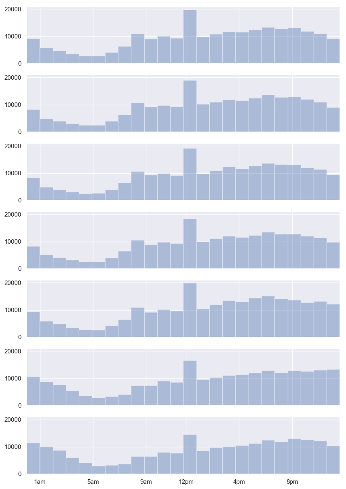
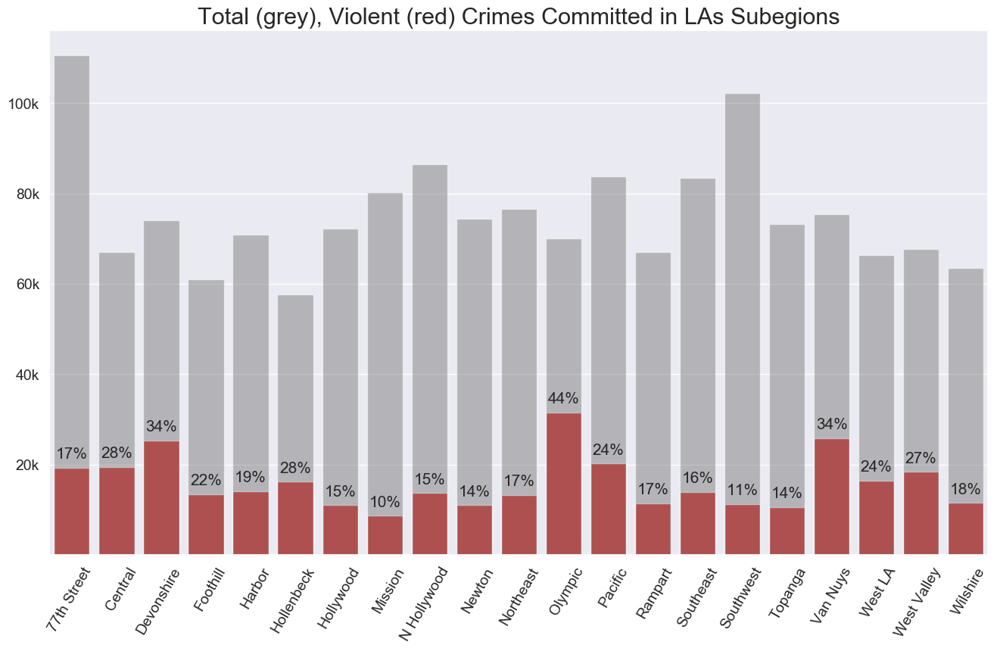

# Crime in Los Angeles

## 1.) Introduction and Goal

A few weeks ago, in downtown LA, somebody stole my bag from right under me.  I'm somewhat new to the area (having been here a few months), so I was curious if this was a regular occurence throughout the city or if I was just in some unlucky area at some unlucky time.  

The next day, I came across this dataset, which includes all the reported crimes in Los Angeles from 2010 to 2017.  So, I decided to build some visualizations and eventually model the distribution of crime in LA.  The dataset I downloaded already included date, time, area ID, report district, crime code & description, lat/long coords, and a bit of other information.  The data doesn't include total population, income, etc, which I'll have to add separately.

The plan, then, is to build a model that predicts the probability of a certain crime type happening at a certain time and location.  I'll use the data from 2010-2017 to create a baseline model and then update with the newer crime data later (after assessing model drift).  

After all that, I should be able to assess how unlucky I was on that fateful Saturday...

## 2.) A Look at the Data

The following data consists of 1.5 million entries (crimes) described by 28 columns.


```python
crime_df = pd.read_csv('Crime_Data_2010_2017.csv')
crime_df.head()
```


<div>
<style scoped>
    .dataframe tbody tr th:only-of-type {
        vertical-align: middle;
    }

    .dataframe tbody tr th {
        vertical-align: top;
    }

    .dataframe thead th {
        text-align: right;
    }
</style>
<table border="1" class="dataframe">
  <thead>
    <tr style="text-align: right;">
      <th></th>
      <th>DR Number</th>
      <th>Date Reported</th>
      <th>Date Occurred</th>
      <th>Time Occurred</th>
      <th>Area ID</th>
      <th>Area Name</th>
      <th>Reporting District</th>
      <th>Crime Code</th>
      <th>Crime Code Description</th>
      <th>MO Codes</th>
      <th>...</th>
      <th>Weapon Description</th>
      <th>Status Code</th>
      <th>Status Description</th>
      <th>Crime Code 1</th>
      <th>Crime Code 2</th>
      <th>Crime Code 3</th>
      <th>Crime Code 4</th>
      <th>Address</th>
      <th>Cross Street</th>
      <th>Location</th>
    </tr>
  </thead>
  <tbody>
    <tr>
      <th>0</th>
      <td>1208575</td>
      <td>03/14/2013</td>
      <td>03/11/2013</td>
      <td>1800</td>
      <td>12</td>
      <td>77th Street</td>
      <td>1241</td>
      <td>626</td>
      <td>INTIMATE PARTNER - SIMPLE ASSAULT</td>
      <td>0416 0446 1243 2000</td>
      <td>...</td>
      <td>STRONG-ARM (HANDS, FIST, FEET OR BODILY FORCE)</td>
      <td>AO</td>
      <td>Adult Other</td>
      <td>626.0</td>
      <td>NaN</td>
      <td>NaN</td>
      <td>NaN</td>
      <td>6300    BRYNHURST                    AV</td>
      <td>NaN</td>
      <td>(33.9829, -118.3338)</td>
    </tr>
    <tr>
      <th>1</th>
      <td>102005556</td>
      <td>01/25/2010</td>
      <td>01/22/2010</td>
      <td>2300</td>
      <td>20</td>
      <td>Olympic</td>
      <td>2071</td>
      <td>510</td>
      <td>VEHICLE - STOLEN</td>
      <td>NaN</td>
      <td>...</td>
      <td>NaN</td>
      <td>IC</td>
      <td>Invest Cont</td>
      <td>510.0</td>
      <td>NaN</td>
      <td>NaN</td>
      <td>NaN</td>
      <td>VAN NESS</td>
      <td>15TH</td>
      <td>(34.0454, -118.3157)</td>
    </tr>
    <tr>
      <th>2</th>
      <td>418</td>
      <td>03/19/2013</td>
      <td>03/18/2013</td>
      <td>2030</td>
      <td>18</td>
      <td>Southeast</td>
      <td>1823</td>
      <td>510</td>
      <td>VEHICLE - STOLEN</td>
      <td>NaN</td>
      <td>...</td>
      <td>NaN</td>
      <td>IC</td>
      <td>Invest Cont</td>
      <td>510.0</td>
      <td>NaN</td>
      <td>NaN</td>
      <td>NaN</td>
      <td>200 E  104TH                        ST</td>
      <td>NaN</td>
      <td>(33.942, -118.2717)</td>
    </tr>
    <tr>
      <th>3</th>
      <td>101822289</td>
      <td>11/11/2010</td>
      <td>11/10/2010</td>
      <td>1800</td>
      <td>18</td>
      <td>Southeast</td>
      <td>1803</td>
      <td>510</td>
      <td>VEHICLE - STOLEN</td>
      <td>NaN</td>
      <td>...</td>
      <td>NaN</td>
      <td>IC</td>
      <td>Invest Cont</td>
      <td>510.0</td>
      <td>NaN</td>
      <td>NaN</td>
      <td>NaN</td>
      <td>88TH</td>
      <td>WALL</td>
      <td>(33.9572, -118.2717)</td>
    </tr>
    <tr>
      <th>4</th>
      <td>42104479</td>
      <td>01/11/2014</td>
      <td>01/04/2014</td>
      <td>2300</td>
      <td>21</td>
      <td>Topanga</td>
      <td>2133</td>
      <td>745</td>
      <td>VANDALISM - MISDEAMEANOR ($399 OR UNDER)</td>
      <td>0329</td>
      <td>...</td>
      <td>NaN</td>
      <td>IC</td>
      <td>Invest Cont</td>
      <td>745.0</td>
      <td>NaN</td>
      <td>NaN</td>
      <td>NaN</td>
      <td>7200    CIRRUS                       WY</td>
      <td>NaN</td>
      <td>(34.2009, -118.6369)</td>
    </tr>
  </tbody>
</table>
<p>5 rows × 26 columns</p>
</div>


```python
crime_df.columns
```


    Index(['DR Number', 'Time Occurred', 'Area ID', 'Area Name',
           'Reporting District', 'Crime Code', 'Crime Code Description',
           'MO Codes', 'Victim Age', 'Victim Sex', 'Victim Descent',
           'Premise Code', 'Premise Description', 'Weapon Used Code',
           'Weapon Description', 'Status Code', 'Status Description',
           'Crime Code 1', 'Crime Code 2', 'Crime Code 3', 'Crime Code 4',
           'Address', 'Cross Street', 'Location ', 'year', 'month', 'day',
           'weekday'],
          dtype='object')


## Can imagine a few questions already:

    1) What is the breakdown by crime per year per area?  Are there any trends?  What about violent vs nonviolent?
    2) Can we create a map using GPS coords and use that to predict how the system will evolve?  How are nearest areas related? 
    3) When do crimes occur?  Does this depend on the type of crime?
    4) Does this data match our shooting data for LA?  What about our population data? Can we include population and income by area and see how that factors in?
    5) Should also check what percentage of crimes (by type/area) get reported. What actually makes it to this list?
    
Most importantly...

<br>

$$ Crime = Bad $$


## 3.) Data Exploration / Visualization

First thing's first --I'm going to plot all the crimes by grouping them into the reporting districts.  Darker dots correspond with more crime according to the legend.  Just a few hot spots exist -- notice the blank spaces in between the data -- these regions are not included in this dataset / analysis


```python
loc_slice = crime_df.query('34.4 > x_loc > 33.9')

loc_slice = loc_slice.groupby('Reporting District').agg(['mean', 'count'])[['x_loc', 'y_loc']]
x_vals = loc_slice['x_loc', 'mean'].values
y_vals = loc_slice['y_loc', 'mean'].values
z_vals = loc_slice['x_loc', 'count'].values

plt.figure(figsize=(10,8))

plt.style.use('default')
sns.scatterplot(x = x_vals, y = y_vals, hue = z_vals, palette = sns.light_palette("#E15700", input="rgb", as_cmap=True, n_colors=12), s=50, alpha = 1)

plt.ylim([-118.7, -118.1])
plt.show()
```


```python
## Let's take a look at some examples of total crime change by category over the last 7 years ##

crime_by_type = crime_df.groupby('Crime Code Description').count()['DR Number'].sort_values(ascending=False)
examples = crime_by_type[[0, 1, 3, 4, 6, 9, 11, 14]].index

df = crime_type_by_year[crime_type_by_year['Crime Code Description'].isin(examples)]

plt.style.use('default')
plt.figure(figsize=(10,8))
p = sns.lineplot(x = df.year, y = df.Crime_per_year, hue=df['Crime Code Description'])
p.legend(loc='center right', bbox_to_anchor=(1.75, 0.5), ncol=1, fontsize='large', labelspacing=2)

plt.xlim([2010, 2016])
plt.show()
```


Next, I show the average hourly crime rate throughout LA.  The red line is specifically violent crimes.


```python
fig, ax = plt.subplots(figsize=(10,8))
sns.set()
sns.distplot(crime_df['Time Occurred'].values, bins=24, kde=False)

# Annotate most frequent crime in that hour
#for hr, crimes in zip(x*100, y):
#    ax.text(hr, crimes + 3000, crimes, horizontalalignment='center', fontdict={'color':'black', 'size':14})

x = crime_severity_hour[crime_severity_hour['crime_type'] == 'violent'].hour.values
y = crime_severity_hour[crime_severity_hour['crime_type'] == 'violent'].crime_class_hr.values
sns.lineplot(x*100, y, color='red')


plt.xlim([0, 2359])
plt.xticks(ticks=[100, 500, 900, 1200, 1600, 2000], labels = ['1am', '5am', '9am', '12pm', '4pm', '8pm'])
plt.show()

## include label that shows most popular crime in that hour ##
```


See an interesting spike in afternoon crime. Alone with the expected rise in the evnenings and drop off in the early hours.

It'll be interesting to see how this depends on the area and type of crime...

<br>

But first, let's see if there's any dependence on weekday...


```python
fig, ax = plt.subplots(7, 1, sharey=True, sharex=True, figsize=(10, 15))

for weekday in crime_df.weekday.unique():
    sns.distplot(crime_df.loc[crime_df['weekday'] == weekday, 'Time Occurred'].values, bins=24, ax=ax[weekday], kde=False)

plt.xlim([0, 2359])
plt.xticks(ticks=[100, 500, 900, 1200, 1600, 2000], labels = ['1am', '5am', '9am', '12pm', '4pm', '8pm'])

plt.show()
```





### Seems pretty similar by weekday. Only differences appear to be the noon spike (stronger during week), and the behavior of late night (higher for the weekend)

        This spike is nothing that exciting.  The extra crimes logged here are identity theft crimes, which happen
        to be mostly filed as "noon" crimes.


```python
#  Looks like identity thefts get default set to noon in the absense of a clear time.  Should impute the average of 11 and 13 to be its new values and note difference #

crime_df.loc[crime_df['Crime Code Description'] == 'THEFT OF IDENTITY', :].groupby('hour').count()['DR Number'].sort_values(ascending=False)
```


    hour
    12    32827
    8     11293
    0     10561
    9      6209
    10     5323
    15     4407
    14     3942
    13     3773
    16     3198
    11     3138
    17     2701
    18     2260
    6      1840
    7      1824
    19     1563
    20     1401
    21      919
    1       905
    23      702
    22      678
    5       314
    2       311
    3       284
    4       280
    Name: DR Number, dtype: int64


When examining the area by are violence rates, notice some areas are much, much worse than others


```python
fig, ax = plt.subplots(figsize=(16,9))

sns.barplot(violent_crime_per_area.index, violent_crime_per_area.values, color='red')
sns.barplot(tot_crime_per_area.index, tot_crime_per_area.values, color='grey', alpha=0.5)

ratio = violent_crime_per_area.values / tot_crime_per_area.values
for i, rat in enumerate(ratio):
    ax.text(i, violent_crime_per_area[i+1] + 2000, str(int(rat * 100))+'%' , horizontalalignment='center', fontdict={'size':15})

plt.xticks(violent_crime_per_area.index - 0.5, rotation=60, horizontalalignment='right', fontsize=14)
plt.yticks(ticks = [20000, 40000, 60000, 80000, 100000], labels = ['20k', '40k', '60k', '80k', '100k'], fontsize=14)
#ax.legend(['Grey', 'Red'], ['Total', 'Violent'])

ax.set_title('Total (grey), Violent (red) Crimes Committed in LAs Subegions', fontdict={'size':22})
ax.set(ylabel='', xlabel='')


plt.show()
```





If we now include the other crime types of THEFT (green) and vehicular (yellow):


```python
violent = crime_df[crime_df['crime_type'] == 'violent'].groupby('Area Name').count()['DR Number']
thefts = crime_df.groupby('Area Name').sum()['theft']
vehicular = crime_df.groupby('Area Name').sum()['vehicular']

fig, ax = plt.subplots(figsize=(16,9))

sns.barplot(thefts.index, thefts.values, color='green', alpha=0.7)
sns.barplot(vehicular.index, vehicular.values, bottom=thefts.values, color='yellow', alpha=0.7)
sns.barplot(violent.index, violent.values, bottom=vehicular.values+thefts.values, color='red')
sns.barplot(tot_crime_per_area.index, tot_crime_per_area.values, color='grey', alpha=0.5)

#ratio = violent_crime_per_area.values / tot_crime_per_area.values
#for i, rat in enumerate(ratio):
#    ax.text(i, violent_crime_per_area[i+1] + 2000, str(int(rat * 100))+'%' , horizontalalignment='center', fontdict={'size':15})

plt.xticks(violent_crime_per_area.index - 0.5, rotation=60, horizontalalignment='right', fontsize=14)
plt.yticks(ticks = [20000, 40000, 60000, 80000, 100000], labels = ['20k', '40k', '60k', '80k', '100k'], fontsize=14)
#ax.legend(['Grey', 'Red'], ['Total', 'Violent'])

#ax.set_title('Total (grey), Violent (red) Crimes Committed in LAs Subegions', fontdict={'size':22})
#ax.set(ylabel='', xlabel='')


plt.show()
```


Though I'll later show the separate map graphic, for now the past violent outbursts can be spotted via a location based scatterplot


```python
figure, ax = plt.subplots(figsize=(12, 10))

cm = plt.cm.jet

# Plot the training points
ax.scatter(X_train['x_loc'], X_train['y_loc'], c=y_train, cmap='viridis', alpha=0.7)
ax.scatter(X_test['x_loc'], X_test['y_loc'], c=y_test, cmap='jet', alpha=0.6)

plt.ylim([-118.7, -118.1])
plt.xlim([33.6, 34.4])

plt.show()
```


```python
# The top 3 areas with the most violent crime are all clustered around the east part of Hollywood's main blvd #

crime_df[crime_df['crime_type'] == 'violent'].groupby('Reporting District').count()['DR Number'].sort_values(ascending=False).head()
```


    Reporting District
    646     1948
    636     1829
    645     1763
    1822    1719
    1801    1669
    Name: DR Number, dtype: int64


## 4) and 5.) Feature Processing (not shown) and Logistic Regression Model (not shown)

## 6.)  Accuracy metric and Decision Boundary

Given the imbalance in classes, it was necessary to toy with the probabilitity assignments for each class (deviating form the normal <50%, >50% assignment).  In any case, the f1 score is still low, but higher than before:


```python
print(classification_report(y_train, LR2.predict(X_train)))
```

                  precision    recall  f1-score   support
    
               0       0.80      0.71      0.75    997366
               1       0.25      0.35      0.29    270080
    
       micro avg       0.63      0.63      0.63   1267446
       macro avg       0.52      0.53      0.52   1267446
    weighted avg       0.68      0.63      0.65   1267446
    
    

Visualization of the violent crime prediction probability by area at a given time sheet (red is more violent)


```python
x_vals = X_unprocessed.loc[train_index].dropna()['x_loc']
y_vals = X_unprocessed.loc[train_index].dropna()['y_loc']

plt.scatter(x=x_vals, y=-y_vals, c=colors[:-2, 1], alpha=0.6, s=1, cmap='jet')

plt.xlim([33.9, 34.3])
plt.ylim([118.2, 118.6])

plt.show()
```


